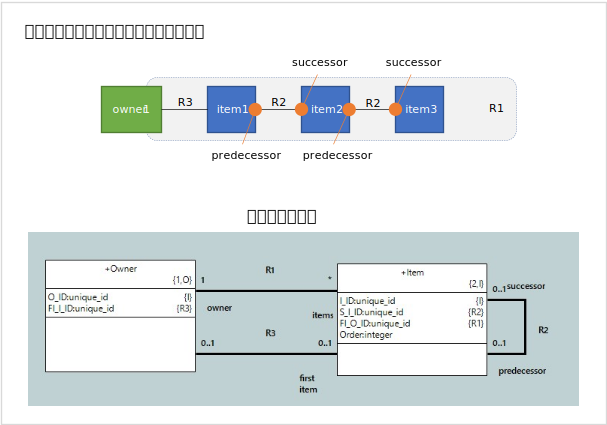
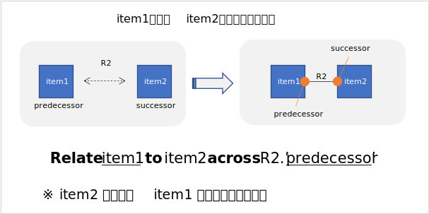
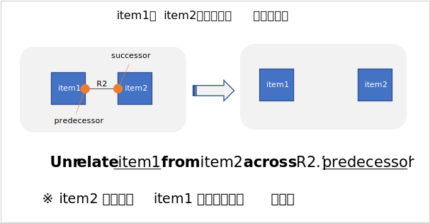
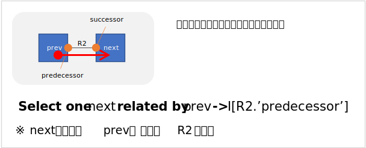
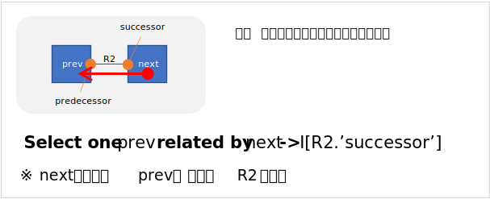

# Sequence pattern  

モデル化対象のドメインで、前後関係がある概念をシンプルにモデル化する場合に使えるパターン。  

単純な順序関係に加えて、何らかのインスタンスに連なっているという概念も加えている。  
例えば、工場のライン毎に順番に並んでいる機械等が該当する。

BridgePoint の workspace に、[モデル](../models/Modeling%20Pattern/)をコピーすると参照可能。   

## アクションパターン  
図中の R2 を元にしたアクション記述は間違いやすいので、参考までに掲載しておく。  

### 前後関係の作成  

※ item1 が Sequence の先頭の場合は、R3の更新も行わなければならない。また、R1 の更新も忘れない事。    

### 前後関係の解消  

※ item1 が Sequence の先頭の場合は、item2 が先頭になるので、それに伴う R3 の更新を行う事。また、item1 を削除する場合は、R1 の Unrelate も忘れない事。  

### 後続（Successor）の取得  

※ 若干、直観に反する様にも見えるので注意が必要。  

### 前方（Predecessor）の取得

※ 若干、直観に反する様にも見えるので注意が必要。  
